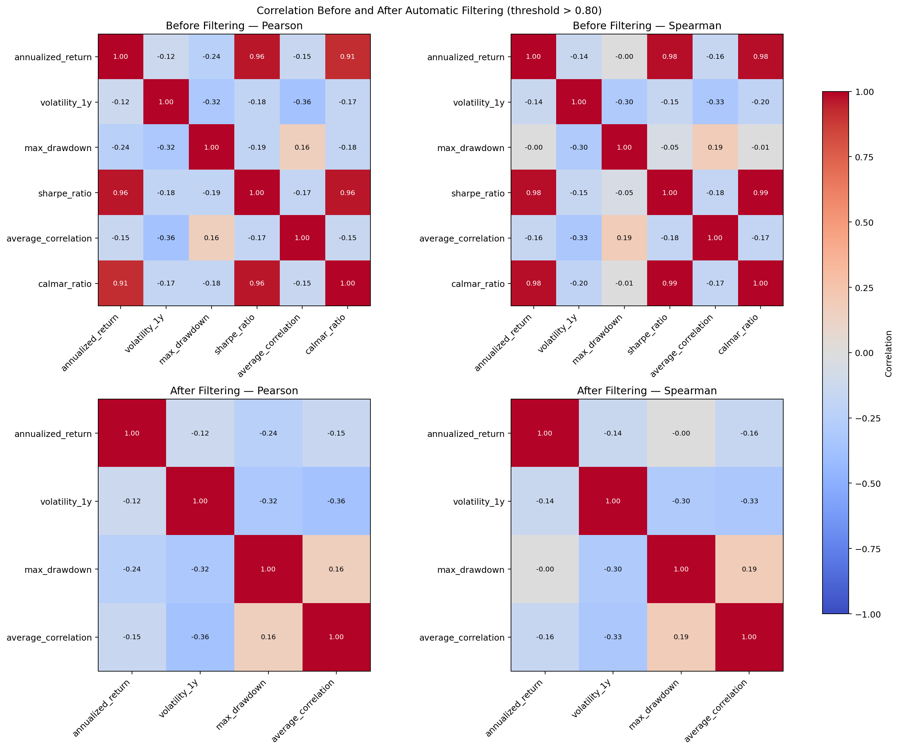
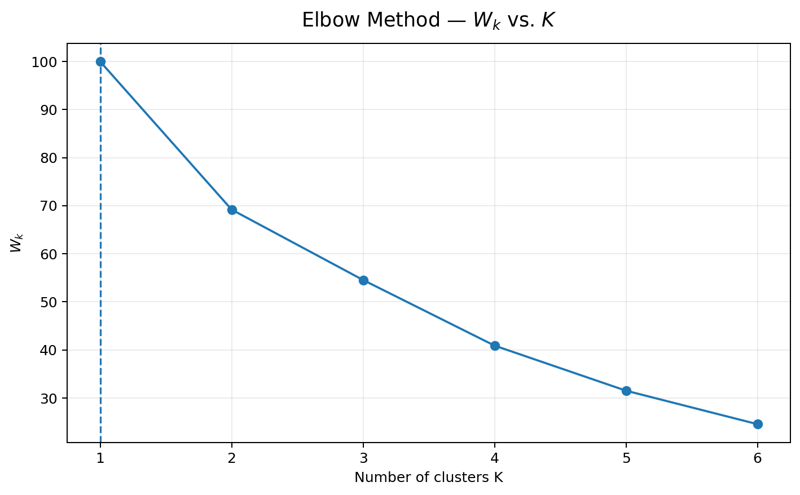
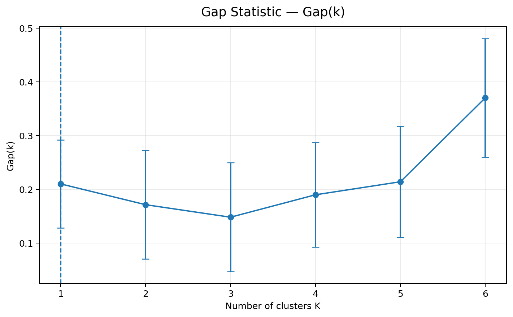
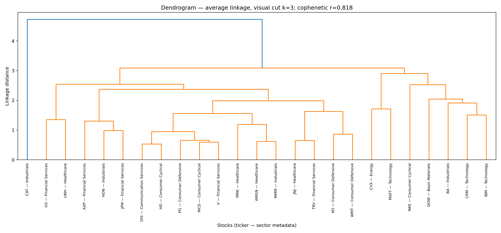
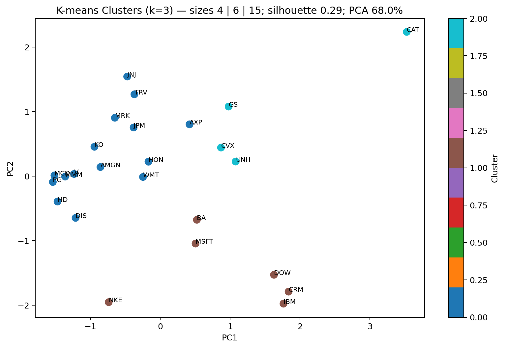
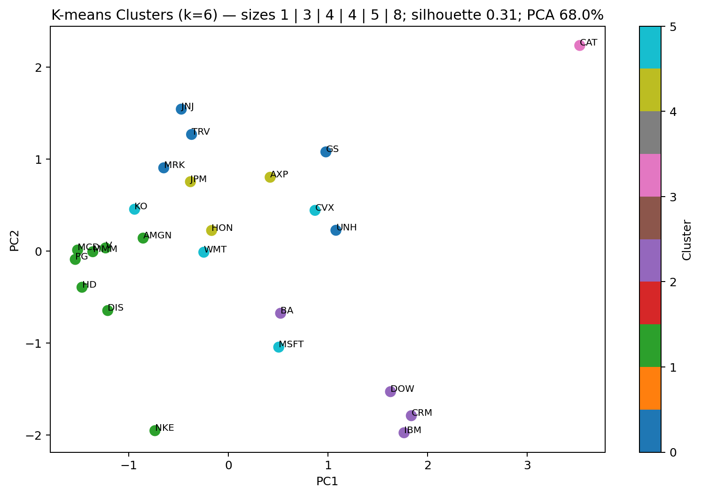
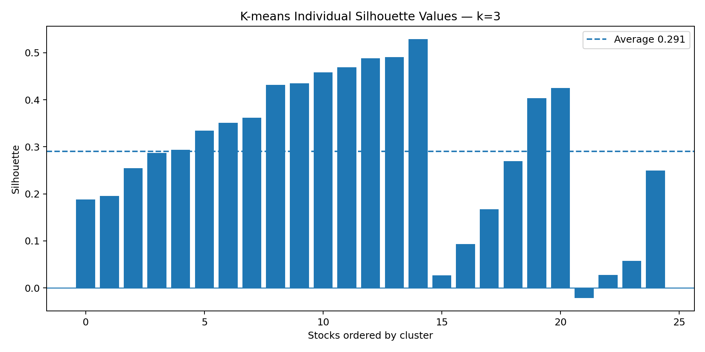
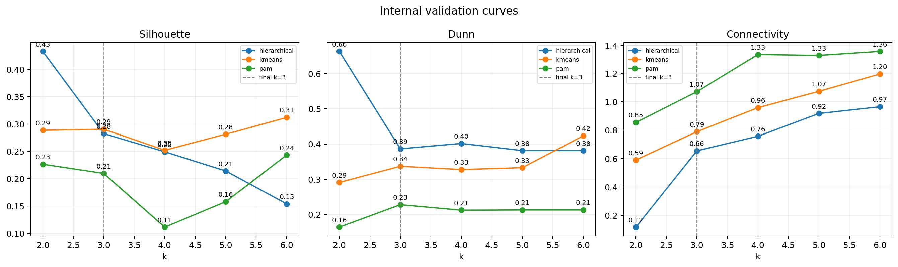

# Dow Stock Clustering

### DANA 4840 — Final Project Part 2

Hierarchical clustering + K-means on 25 Dow stocks

<!--
Cover (~30 sec). Introduce yourself and the course project.
-->

---

## Goal

I want to group stocks with a **similar risk–return profile**.

- **Not** price prediction
- **Not** sector labels as input
- **Yes** exploratory clusters from financial features

Data: 25 Dow stocks from a local Excel workbook (5 tickers missing from Dow 30).

<!--
Goal slide (~45 sec). Keep it simple: we cluster by behavior, not by industry name.
-->

---

## Features (4)

I use four comparable features:

| Feature | Meaning |
|---------|---------|
| `annualized_return` | Return over the period |
| `volatility_1y` | Price volatility |
| `max_drawdown` | Largest peak-to-trough loss |
| `average_correlation` | Correlation with the market |

All features are **scaled** before clustering.

<!--
Features (~1 min). Explain why scaling matters for distance-based methods.
-->

---

## Correlation screening

- Started with 6 features; `sharpe_ratio` and `calmar_ratio` were very similar to `annualized_return` (ρ > 0.8)
- Removed redundant variables to avoid **collinearity**
- Final set: **4** comparable risk–return features

<!--
Correlation (~1 min). Distance clustering is sensitive to correlated columns.
-->

---

## Hopkins statistic

Before clustering, I check if the data looks clusterable.

- Hopkins median ≈ **0.97** (high)
- Near **1** → more clustered than random uniform points
- Near **0.5** → similar to random

**Result:** clustering is reasonable for this dataset.

<!--
Hopkins (~45 sec). It is a tendency check, not proof of perfect groups.
-->

---

## Elbow method

Elbow suggests **k ≈ 6**, but this is only a first hint — not the final choice.

<!--
Elbow (~45 sec). W_k drops then flattens; dashed line marks gap-optimal k.
-->

---

## Gap statistic

Gap also points to **k = 6**, but small groups at k = 6 led us to retest **k = 3–6** with class metrics.

<!--
Gap (~45 sec). Gap compares real data vs random uniform reference.
-->

---

## Linkage comparison

I compared **five** linkage methods with **cophenetic correlation**:

| Linkage | Cophenetic r |
|---------|--------------|
| **average** | **0.82** |
| single | 0.80 |
| complete | 0.74 |
| ward2 | 0.73 |
| ward | 0.58 |

`ward` uses Euclidean; `ward2` uses squared Euclidean (R `ward.D2`).

**Winner:** average linkage → used for the dendrogram.

<!--
Linkage (~1 min). Cophenetic = how well the tree matches original distances.
-->

---

## Dendrogram

- Each leaf = one stock; height = linkage distance (not price)
- **Sector** is shown only for reading — not used in clustering
- Average linkage, cophenetic **0.82**

The dendrogram helps compare **structure**. Final labels come from **K-means** (more balanced groups).

<!--
Dendrogram (~1 min). Tree shows structure; K-means gives final balanced labels.
-->

---

## Why retest k?

First check (elbow, gap, etc.) suggested **k = 6**.

Problem: some groups had **only 1 stock**.

So I retested **k = 6, 5, 4, and 3** with class metrics:

- Silhouette
- Dunn index
- Rand / ARI (K-means vs hierarchical)
- Rule: reject k with a one-stock cluster

<!--
Why retest (~1 min). This is the main story of the project.
-->

---

## K comparison

| k | K-means sizes | OK? (no 1-stock cluster) |
|---|---------------|---------------------------|
| 6 | 1 \| 3 \| 4 \| 4 \| 5 \| 8 | No |
| 5 | 1 \| 3 \| 5 \| 8 \| 8 | No |
| 4 | 1 \| 6 \| 8 \| 10 | No |
| **3** | **4 \| 6 \| 15** | **Yes** |

Only **k = 3** passes the rule.

<!--
Table (~1 min). Walk through why k=6 fails and k=3 wins.
-->

---

## Final result: k = 3

**K-means with k = 3**

- Silhouette: **0.29** (weak but positive)
- Dunn: **0.34**
- Rand vs hierarchical: **0.86**
- ARI vs hierarchical: **0.73**

Silhouette &lt; 0.50 → **exploratory groups**, not perfect natural clusters.

<!--
Final k (~1 min). Numbers come from the executed notebook.
-->

---

## K-means clusters — k = 3 (selected)

- Cluster sizes: **4 | 6 | 15** — all groups have ≥ 2 stocks
- Silhouette: **0.29**
- PCA is for **display only** — clustering uses all 4 features

<!--
K-means k=3 (~45 sec). Final choice: balanced groups, no singletons.
-->

---

## K-means clusters — k = 6 (not selected)

- Cluster sizes: **1 | 3 | 4 | 4 | 5 | 8** — one group has only **1 stock**
- Silhouette: **0.31** (slightly higher, but fails our rule)
- Higher k looks better on paper, but creates unstable singleton clusters

<!--
K-means k=6 (~45 sec). Compare with k=3: better silhouette but one-stock cluster.
-->

---

## Silhouette plot

- Average silhouette **0.29** (&lt; 0.50 → weak but useful groups)
- **Negative bars** = stock is closer to another cluster than its own → borderline assignment
- Some stocks send a **mixed signal**; normal with overlapping financial profiles

<!--
Silhouette (~1 min). Negative bars mean awkward position between clusters.
-->

---

## Internal validation curves

- 3 internal measures × 3 methods (hierarchical, kmeans, pam), k = 2–6
- Dashed line = final **k = 3**
- At k = 3: hierarchical wins Dunn/connectivity; kmeans close on silhouette

<!--
Internal curves (~1 min). Internal metrics often peak at k=2; we still pick k=3 for balance.
-->

---

## Internal vs external validation (K-means, k = 3–6)

<table style="width: 100%; border-collapse: collapse;">
  <thead>
    <tr style="border-bottom: 2px solid #ccc;">
      <th style="text-align: left; padding: 6px;">Measure</th>
      <th style="padding: 6px;">k = 3</th>
      <th style="padding: 6px;">k = 4</th>
      <th style="padding: 6px;">k = 5</th>
      <th style="padding: 6px;">k = 6</th>
      <th style="text-align: left; padding: 6px;">Rule</th>
    </tr>
  </thead>
  <tbody>
    <tr>
      <td style="padding: 5px;">K-means Silhouette</td>
      <td style="padding: 5px; text-align: center;">0.29</td>
      <td style="padding: 5px; text-align: center;">0.25</td>
      <td style="padding: 5px; text-align: center;">0.28</td>
      <td style="padding: 5px; text-align: center; background-color: #c6f6d5; font-weight: 600;">0.31</td>
      <td style="padding: 5px;">higher ↑</td>
    </tr>
    <tr>
      <td style="padding: 5px;">K-means Dunn</td>
      <td style="padding: 5px; text-align: center;">0.34</td>
      <td style="padding: 5px; text-align: center;">0.33</td>
      <td style="padding: 5px; text-align: center;">0.33</td>
      <td style="padding: 5px; text-align: center; background-color: #c6f6d5; font-weight: 600;">0.42</td>
      <td style="padding: 5px;">higher ↑</td>
    </tr>
    <tr>
      <td style="padding: 5px;">ARI vs hierarchical</td>
      <td style="padding: 5px; text-align: center; background-color: #c6f6d5; font-weight: 600;">0.73</td>
      <td style="padding: 5px; text-align: center;">0.44</td>
      <td style="padding: 5px; text-align: center;">0.21</td>
      <td style="padding: 5px; text-align: center;">0.25</td>
      <td style="padding: 5px;">higher ↑</td>
    </tr>
    <tr>
      <td style="padding: 5px;">ARI vs sector</td>
      <td style="padding: 5px; text-align: center;">0.06</td>
      <td style="padding: 5px; text-align: center;">0.08</td>
      <td style="padding: 5px; text-align: center;">0.11</td>
      <td style="padding: 5px; text-align: center; background-color: #c6f6d5; font-weight: 600;">0.12</td>
      <td style="padding: 5px;">external (low OK)</td>
    </tr>
    <tr style="border-top: 1px solid #ddd;">
      <td style="padding: 5px;"><strong>Min cluster size</strong></td>
      <td style="padding: 5px; text-align: center; background-color: #c6f6d5; font-weight: 600;">4</td>
      <td style="padding: 5px; text-align: center; background-color: #fed7d7;">1</td>
      <td style="padding: 5px; text-align: center; background-color: #fed7d7;">1</td>
      <td style="padding: 5px; text-align: center; background-color: #fed7d7;">1</td>
      <td style="padding: 5px;">must be ≥ 2</td>
    </tr>
  </tbody>
</table>

  Green = best value in that row &nbsp;|&nbsp;
  Red = fails the min-size rule

**Only k = 3** passes (no 1-stock cluster). k = 6 wins some internal scores but creates singleton groups.

External (same for all k): Hopkins **0.97**, cophenetic **0.82** → data is clusterable; dendrogram fits well.

<!--
Validation (~1 min). Green = best per row. k=6 looks good on silhouette/Dunn but fails min cluster size.
-->

---

## Limitations

- Only **25 stocks** (not full Dow 30)
- **One time window** of data
- **k = 3** is a practical choice, not the only possible answer
- Do **not** call these stable market segments without more data

Good for: course project, comparing methods, exploratory profiles.

<!--
Limitations (~45 sec). Be honest — this builds trust with the instructor.
-->

---

## Conclusion

1. Data has cluster tendency (Hopkins high)
2. **Average linkage** best fits distances (cophenetic ~0.82)
3. **k = 3** gives balanced groups (4 \| 6 \| 15)
4. K-means and hierarchical agree (ARI ~0.73)
5. Groups ≠ sectors (ARI vs sector ~0.06)

**Files:** Python notebook + R report (`Final_Project_Part2.Rmd`)

Thank you — questions?

<!--
Closing (~30 sec). Mention where code and report live for grading.
-->
