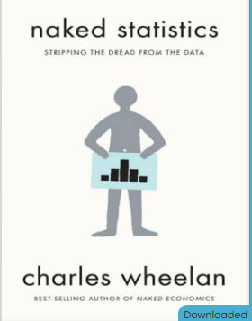
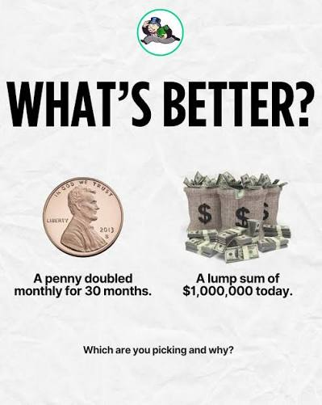
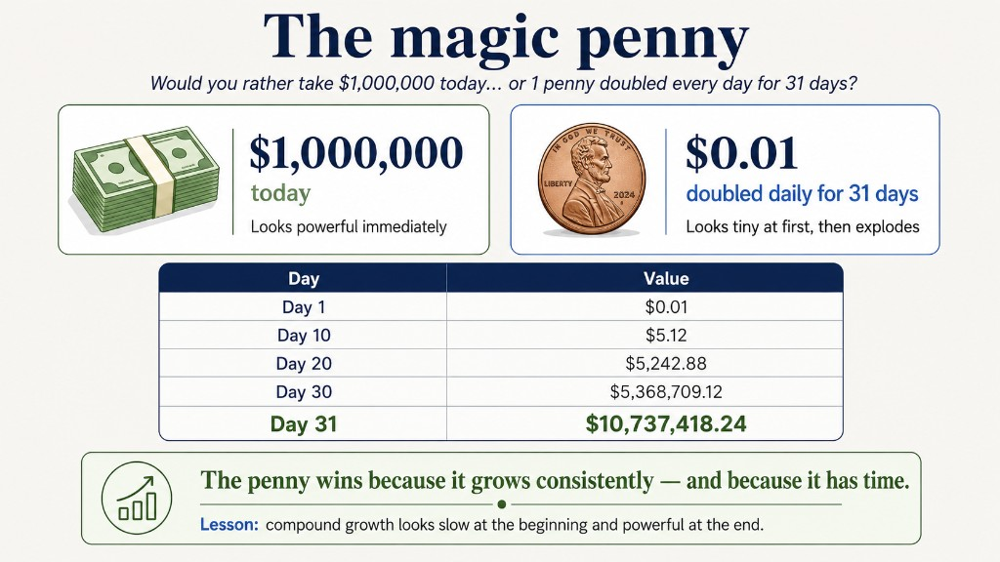
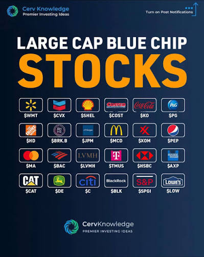
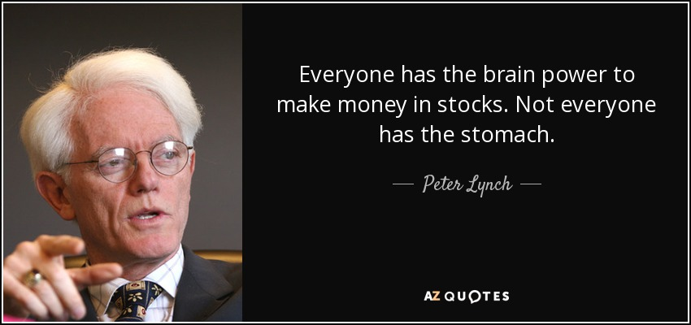
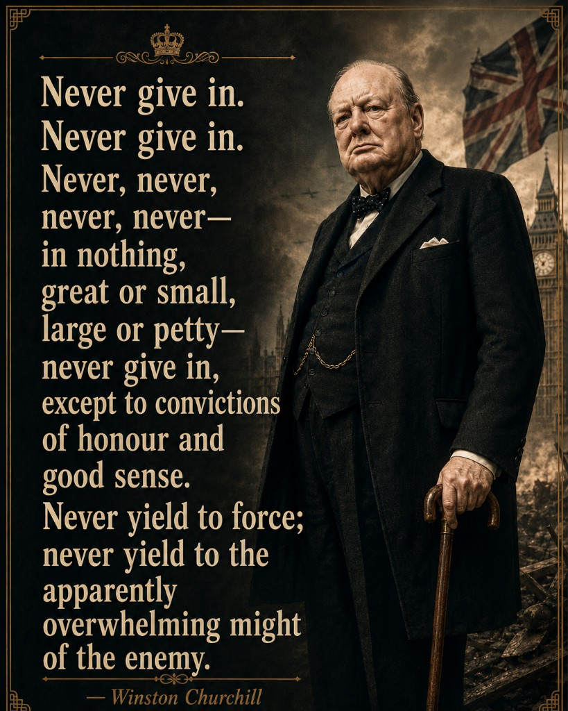

# Time Makes Small Actions Powerful

### What if your "savings account" is slowly losing you money?

You can protect and grow your money by building an emergency fund first, then letting time work on the rest.

Time makes small actions powerful · Smart money habits are a skill — not a product pitch.

<!--
Timing: cover (~20 sec). Hook + you-focus message. Press Space to start.
-->

---
layout: default
class: text-center finance-slide-fit
background: '#efede9'
---

# Working hard is not always enough.

### Where your money goes depends on your habits — not just your paycheck.

💼

Income comes in

🧾

Keeping it safe

<ul class="finance-sub text-xs list-disc pl-4 mt-1 space-y-0.5"><li>banks</li><li>Neobanks</li></ul>

📉

Inflation erodes it

The same cash buys less over time.

💱

Currency risk matters

FX moves can reduce your money's value abroad.

Money needs more than safety — it needs protection and growth.

<!--
Timing: ~1 min (Slide 2)

AUDIENCE (say aloud): Classmates, young adults — freedom and independence matter; banks pay little and school rarely teaches investing.

PATHOS setup: Hard work alone is not enough if habits do not protect what you earn.

LOGOS preview: Three forces — safety, inflation, FX — shape what your money can do.
-->

---
layout: default
class: text-center
---

# The invisible enemy: inflation

### When prices rise, the same money buys less.

$100

20 years ago

$100

today — buys less

Same number on the label. Less power in your pocket.

"Statistics strip away the mystery — inflation is just data showing that prices rise over time."

Charles Wheelan, Naked Statistics

<a href="https://www.bankofcanada.ca/rates/related/inflation-calculator/" target="_blank" rel="noopener" class="finance-link mt-3 inline-block text-sm">canada bank — Inflation Calculator</a>
<a href="https://www.minneapolisfed.org/about-us/monetary-policy/inflation-calculator" target="_blank" rel="noopener" class="finance-link mt-3 inline-block text-sm">Minneapolis Fed — Inflation Calculator</a>

<!--
Timing: ~1 min (Slide 3)

LOGOS: inflation data + calculators. UNMET NEED (say aloud): Banks pay very little; school teaches "save" but not how to protect purchasing power.
-->

---
layout: default
class: text-center
---

## First: protect your peace of mind

### Before investing, build an emergency fund.

<ul class="space-y-2 text-base">
</ul>

build order

Essential expenses

Rent · food · tuition

Emergency fund

3–6 months of essentials

Long-term investing

Money you won't need for years

Do not invest money you may need soon. Build the base first.

<!--
Timing: ~1 min (Slide 4)

PATHOS: stress vs. hope / financial freedom. LOGOS: build order before growth.
-->

---
layout: default
class: text-center finance-slide-zoom
---

# Your emergency money can still work

### A high-interest savings account can reduce inflation's impact while keeping access.

High-interest savings

Better

Still liquid · fights inflation partially

Example — Canada

Wealthsimple Chequing (Cash): variable rate — check the app before you decide.

Often ~1.25–2.25% depending on tier & direct deposit.*

<a href="https://help.wealthsimple.com/hc/en-ca/articles/9730610402075-Learn-about-the-Wealthsimple-Cash-account-interest-rate" target="_blank" rel="noopener" class="finance-link-on-dark text-xs mt-2 inline-block">Verify current rate →</a>

Investing

Higher potential

More risk · long-term money only

Examples — Canada

<ul class="finance-sub text-xs mt-1 list-disc pl-4 space-y-0.5"><li>Wealthsimple Invest — simple portfolios</li><li>Questrade — DIY ETFs</li><li>Moomoo — trading app (check fees & registration)</li></ul>
<a href="https://www.ciro.ca/investors/choosing-investment-advisor/check-registration" target="_blank" rel="noopener" class="finance-link-on-dark text-xs mt-2 inline-block">Verify firm is registered (CIRO) →</a>

*Rates and products change. Examples only — not a recommendation.

Your bank account is for <strong>access</strong>, not for your <strong>entire future</strong>.

<!--
Timing: ~1 min (Slide 5)
-->

---
layout: two-cols-header
class: text-center finance-slide-zoom
---

# The Compound Effect

### Small actions repeated over time create extraordinary results

::left::

"Compound growth is what happens when small actions are repeated consistently over enough time."

"At first, almost nothing seems to change. Then results accelerate."

It is not about doing something huge once. It is about doing something small many times until time makes it powerful.

::right::

📘

The Compound Effect

Darren Hardy

Source: Darren Hardy, <em>The Compound Effect</em>

<!--
Timing: ~1 min (Slide 6)

Book + behavior — math comes on the next slide.
-->

---
layout: two-cols-header
class: text-center finance-slide-zoom
---

# Future Value

### What recurring contributions become over time

::left::

<strong>Future value (FV)</strong> — the total you end up with after <strong>n</strong> years, earning return <strong>r</strong>, when you add <strong>PMT</strong> each period.

FV
=
PMT
×

(1 + r)n − 1
r

<dl class="finance-formula-legend">
<dt>PMT</dt><dd>payment each period (your capital injection)</dd>
<dt>r</dt><dd>return per year (as a decimal, e.g. 0.07 = 7%)</dd>
<dt>n</dt><dd>number of years</dd>
</dl>

<a href="https://www.td.com/ca/en/personal-banking/personal-investing/compound-interest-calculator" target="_blank" rel="noopener" class="finance-link text-sm mt-3 inline-block">TD — Compound Interest Calculator →</a>

::right::

<!--
Timing: ~1.5 min (Slide 7)

Define FV + annuity formula; TD calculator to try your own PMT, r, n.
-->

---
layout: two-cols-header
class: text-center finance-slide-zoom
---

# Ronald Read

### An ordinary worker who built ~$8 million

::left::

Ronald James Read (1921–2014)

<a href="https://en.wikipedia.org/wiki/Ronald_Read_(philanthropist)" target="_blank" rel="noopener" class="finance-link text-xs mt-1 inline-block">Wikipedia →</a>

::right::

<ul class="space-y-2 text-sm">
<li>Gas station attendant & janitor — Brattleboro, Vermont</li>
<li>Lived frugally for decades; read <em>The Wall Street Journal</em> daily</li>
<li>Buy-and-hold investor in ~95 blue-chip, dividend-paying stocks</li>
<li>Estate ~$8 million — mostly to hospital & library (2014)</li>
</ul>

Ethos, not a promise — consistency beats a high salary.

<!--
Timing: ~1.5 min (Slide 8)

ETHOS: Ronald Read — Wikipedia. PATHOS tie-in: ordinary person, extraordinary patience.
-->

---
layout: default
class: text-center finance-slide-zoom
---

# What Ronald Read actually bought

### Large-cap blue-chip stocks — patient, dividend-focused, diversified

Examples only — not recommendations. Ronald Read held ~95 stocks across many industries; research before you buy.

<!--
Timing ~30 sec (Slide 9). Bridge from Ronald Read to what blue-chip means in practice.
-->

---
layout: default
class: text-center
---

# What many people think at first

### Three hesitations — and straight answers

"I don't have enough money."

→ Start small — even <strong>$20/month</strong> builds the habit.

$20/mo × 10 yrs ≈ <strong>~$3,100</strong> at ~5%* — illustrative, not a promise.

"Investing is too risky."

→ Learn first; diversify; long-term money only.

Markets fall — long-term investors stay the course. Never invest emergency cash.

"I only trust cash / one currency."

→ Cash loses to inflation; one currency can hurt abroad.

Next: real FX example →

<!--
Timing: ~1 min (Slide 9)

LOGOS: $20/mo example. Overcome objections 1–3; slide 10 answers objection 3 with numbers.

INTERNATIONAL COUNTER-ARGUMENTS (speaker prep — optional, not on slide):
IRAN, MONGOLIA, INDIA, JAPAN, MEXICO, PERU, THAILAND — see prior outline responses.
-->

---
layout: default
class: text-center
---

# Currency risk — answering objection 3

### "I only trust cash / one currency" — but FX moves still cost you

Example: USD/CAD

1.33
→
1.42

Move: <strong>+0.09</strong> (illustrative — same idea as your outline)

Live: <strong>~1.4215</strong> · <strong>+4.18%</strong> over 12 months (TradingView, Jul 2026)

<a href="https://www.tradingview.com/symbols/USDCAD/?timeframe=12M" target="_blank" rel="noopener" class="finance-link-on-dark text-xs mt-2 inline-block">TradingView — USD/CAD 12M chart →</a>

Tuition impact

C$8,000 × 0.09 =

C$720

Extra cost from FX move alone

If USD/CAD rises, paying in U.S. dollars costs more in loonies — even if you "only hold cash."

Diversification across purposes — and sometimes currencies — can help protect you. Not a promise to buy dollars; a reason to plan beyond "all cash."

<!--
Timing: ~1 min (Slide 10)

LOGOS: FX math from outline. Completes objection 3 response.
-->

---
layout: default
class: text-center
---

# Your first actions this week

### This week — two lookups and one habit

✓

Find one <strong>high-interest savings account</strong> for emergency money.

Example: Wealthsimple Cash — verify current rate in the app.

✓

Learn one <strong>simple long-term investing</strong> option — develop a plan, do your own research.

Examples (Canada): Wealthsimple Invest · Questrade · Moomoo — check fees & <a href="https://www.ciro.ca/investors/choosing-investment-advisor/check-registration" target="_blank" rel="noopener" class="finance-link-on-dark">CIRO registration</a>.

✓

Label every dollar: <em>spend</em>, <em>emergency</em>, or <em>future</em>.

Not financial advice. Examples only — not recommendations.

<!--
Timing: ~1 min (Slide 11). CTA from outline — specific actions + Canada examples.
-->

---
layout: default
class: text-center
---

# Start with investing — not trading

### An intro distinction before you take action

You can protect and grow your money by building an emergency fund first, then letting time work on the rest.

Trading

<ul class="text-xs space-y-0.5 list-disc pl-4">
<li>Short-term · frequent buys/sells</li>
<li>Timing the market · higher stress</li>
<li>Apps like Moomoo — know fees & risks</li>
</ul>

Not what this talk is pushing today.

Long-term investing

<ul class="text-xs space-y-0.5 list-disc pl-4">
<li>Small amounts · many years</li>
<li>Compound growth · Ronald Read's path</li>
<li>HISA for emergencies · invest the rest</li>
</ul>

Start here — even $20/month.

<strong>Your move this week:</strong> one high-interest savings account + one simple long-term option. Learn the difference, make a plan, do your own research.

Time makes small actions powerful.

More options later — not quitting work tomorrow.

<!--
Timing ~45 sec (Slide 12). Trading vs investing + final CTA + tagline.
-->

---
layout: default
class: text-center finance-quote-slide
---

# Stay the course

### Long-term investing takes patience — not panic

Markets fall. The goal is not to trade every move — it is to stay invested long enough for time to work.

<!--
Timing ~30 sec (Slide 13). PATHOS + ETHOS: Lynch stomach / Churchill never give in.
-->

---
layout: default
class: text-center
---

# References

- Juan David V — Aprende a Invertir: https://www.youtube.com/@aprendeainvertirco
- Ronald Read story: https://www.youtube.com/watch?v=UzpEBknU600
- Ronald Read biography: https://en.wikipedia.org/wiki/Ronald_Read_(philanthropist)
- How to Live Off Investments: https://www.youtube.com/watch?v=npem3sCMERc
- The Intelligent Investor journey: https://www.youtube.com/watch?v=9MZW0qsMuCo
- Darren Hardy, *The Compound Effect*: https://store.darrenhardy.com/products/the-compound-effect
- *The Compound Effect* (Google Books): https://books.google.com/books/about/The_Compound_Effect.html?id=P28DsLkv5cgC
- Benjamin Graham, *The Intelligent Investor*
- Peter Lynch, *One Up on Wall Street*
- Morgan Housel, *The Psychology of Money*
- James Clear: https://jamesclear.com/book-summaries/the-compound-effect
- John J. Murphy, *Technical Analysis of the Financial Markets* (general reference)
- Investor.gov calculator: https://www.investor.gov/financial-tools-calculators/calculators/compound-interest-calculator
- Bank of Canada, inflation & CPI: https://www.bankofcanada.ca/core-functions/monetary-policy/inflation/
- TradingView USD/CAD (12M): https://www.tradingview.com/symbols/USDCAD/?timeframe=12M

All growth numbers are educational examples, not investment promises.

<!--
Timing: BACKUP ONLY. Do not present live unless asked. Hand out or share link after class.
-->
